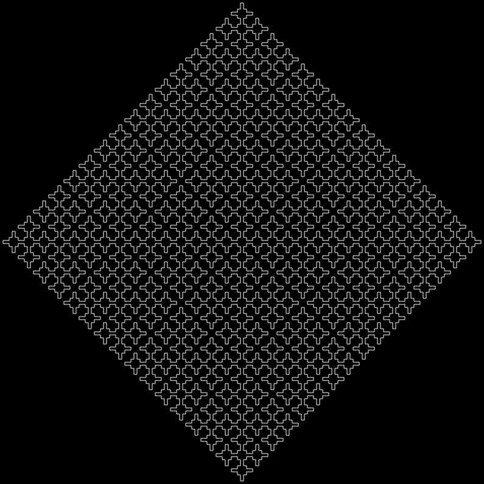

# liblmayer
## Contents
- [Overview](#overview)
- [What is an L-System](#what-is-an-l-system)
    - [How it Works](#how-it-works)
    - [Formal Definition](#formal-definition)
- [How liblmayer works](#how-liblmayer-works)
    - [Features](#features)
    - [Configuration File Format](#configuration-file-format)
    - [Configuration File Parsing](#configuration-file-parsing)
    - [Axiom Expansion using Production Rules](#axiom-expansion-using-production-rules)
    - [Convert to SVG](#convert-to-svg)
    - [Helper Data Structures](#helper-data-structures)
- [Example L-System renderings](#example-l-system-renderings)
    - [Square Sierpinski](#square-sierpinski)
    - [A Rather Beautiful Tree](#a-rather-beautiful-tree)
- [Usage](#usage)

 
## Overview 
liblmayer is a modular C library designed to provide functionality to parse and interpret L-system (Lindenmayer system) configurations and render them as SVG graphics.

This library is divided into three major components:
- **The Configuration File Parser**: Responsible for parsing the configuration file and extracting necessary information. The functions for this are provided in `src/parseconf.h`
- **The String Expander**: Responsible for applying the Production Rules to the Axiom for specified length. The functions for this are provided in `src/strexp.h`
- **SVG Renderer**: Responsible for taking a string and a step_length and outputting the proper SVG file. The functions for this are provided in `src/render.h`

---

## What is an L-system?
An **L-system (Lindenmayer System)** is a mathematical formalism originally introduced to model the growth of plants. Today, it is widely used in computer graphics, procedural generation, and fractal generation.

An L-system consists of:

1. **Alphabet** – A set of symbols (characters) that can be used to form strings.
2. **Axiom** – The initial string from which the system starts evolving.
3. **Production Rules** – A set of rules that specify how each symbol in the string is replaced by another string in each iteration.

For further reading: https://en.wikipedia.org/wiki/L-system

---

### How it Works

The process works iteratively:

1. Start with the **Axiom** (initial string).
2. For each iteration (or generation):
   - Replace each symbol in the string using the corresponding **Production Rule**.
   - Symbols without a rule are typically left unchanged.
3. After a specified number of iterations, the resulting string can be interpreted (for example, using turtle graphics to render plant-like structures, fractals, etc.).

---

### Formal Definition

An L-system is defined by the tuple:
L = (V, ω, P)
Where:
- **V** → Alphabet (set of symbols)
- **ω** → Axiom (initial string)
- **P** → Set of production rules


*Note: This library currently only supports the Alphabet Set-> V={A-Z , a-z , + , - , [ , ]}*
*Some systems use symbols like <,>,| to mean specific things to the renderer, however I have not implemented them yet*

---

## How liblmayer Works
### Features:
- Parses a simple L-system configuration file.
- Supports multiple rules and customizable parameters.
- Outputs an SVG file that visually represents the L-system after expansion.
- Implements turtle graphics with turn angles (Delta) and line segments.

### Configuration File Format:
A plain text file defining:
```
Axiom: The starting string.
NumRules: Number of production rules.
Rule: Each rule in the format Rule:Predecessor->Successor.
Delta: Turning angle in degrees (for turtle rendering).
Length: Number of iterations to apply the production rules.
```
### Configuration File Parsing:
- Use `void parseNumRules(int* numRules,FILE* fp)` to parse the Number of Rules from the file pointer **fp** and store in **numRules**.
- Use `void parseConfig(Word* Axiom,Rule* rules,int* length, int* delta,FILE* fp)` to parse the Axiom into *Word\** **Axiom**, all the Rules into a *Rule* array **Rules**, the **Length** and the **Delta** from **fp**. 
### Axiom Expansion using Production Rules:
- Use `Word* strexp(Word* Axiom,Rule* rules,int numRules,int length)` to expand **Axiom** using the production **rules** for **length** number of times.
### Convert to SVG:
- Use `void drawLSystem(Word* instructions, double angleDelta, double step, const char* filename)` to convert the expanded string, or **instructions** into an SVG file with the name **filename**. **angleDelta** is the angle rotated by the [turtle](https://en.wikipedia.org/wiki/Turtle_graphics) while drawing and **step** is the length of each forward stroke.
### Helper Data Structures:
- `Word.h`:
```
typedef struct Word{
    char* data;
    size_t currSize;
    size_t capacity;
}Word;

void initArr(Word *arr,size_t initialCap);
void append(Word* arr,char c);
void printArrData(Word* arr);
void printArrDetails(Word *arr);
void appendCharWise(Word* string, char* change);
```
A resizable array used to store the expanded string
- `rule.h`:
```
typedef struct Rule{
    char predecessor;
    char* successor;
}Rule;
```
A simple structure to store the rules as mappings from a single character to a string.

---

## Example L-System renderings:
### Square Sierpinski
- Config file:
```
Axiom:F+XF+F+XF
NumRules:1
Rule:X->XF-F+F-XF+F+XF-F+F-X
Delta:90
Length:5
```
- Finished Render:



---

### A rather beautiful Tree
- Config file:
```
Axiom:X 
NumRules:2
Rule:F->FF 
Rule:X->F+[-F-XF-X][+FF][--XF[+X]][++F-X]
Delta:20
Length:7
```
- Finished Render:


---

## Usage
- Copy the includes and src folders in your project.
- Include the required headers (for e.g. #include <render.h> or #include <word.h>)
- Make sure to compile the src files before linking them with the main executable. For example, the compile line can be something like:
`gcc src/* example.c -o example`
- This would create the required executable


